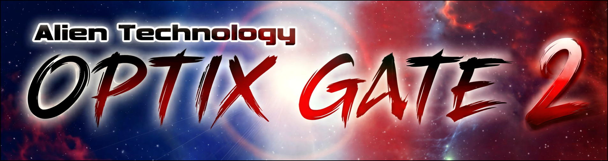
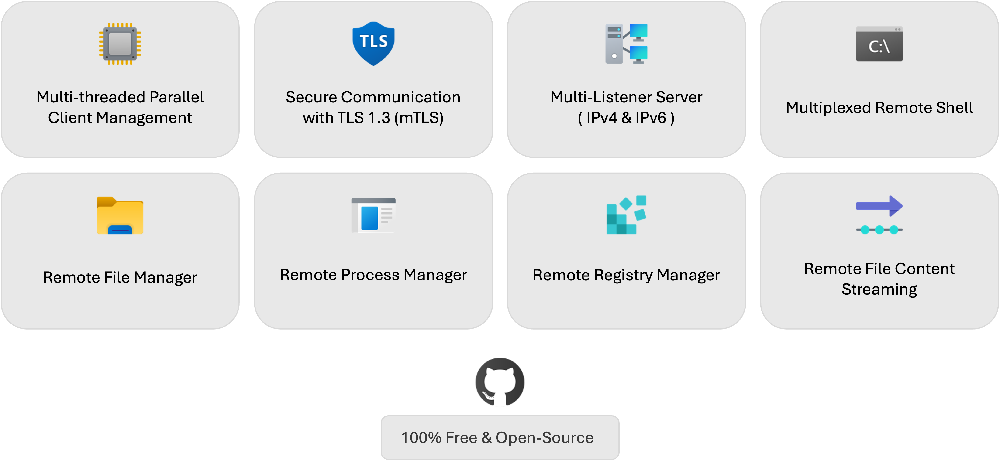
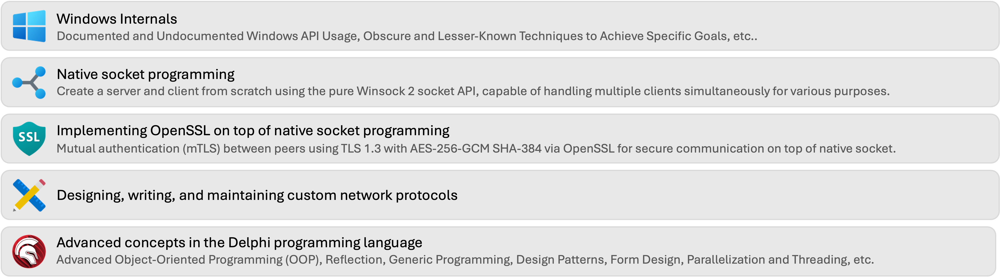
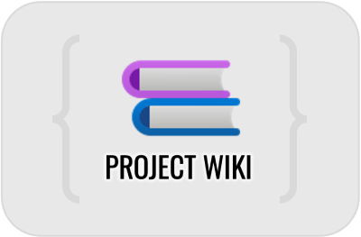
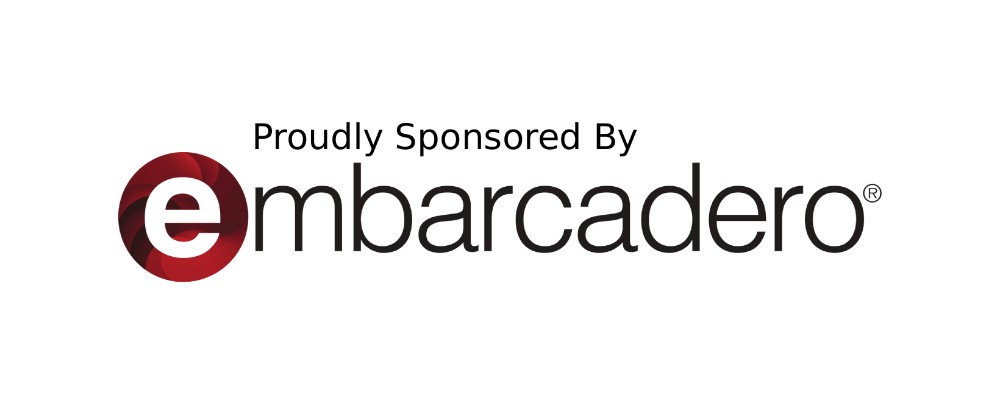

Optix Gate is a multi-purpose secure remote administration tool for Microsoft Windows. It provides remote access to multiple Windows sessions and/or machines simultaneously.

### History

Optix Gate was created, among other things, to maintain and further develop my Windows application programming skills. Today, my professional work focuses more on offensive security topics than on software development. This project enables me to continue practicing low-level and system programming in my free time, as I did earlier in my career.

The name Optix Gate references a well-known RAT from the 2000s. The visual design intentionally echoes that era of the underground Malware scene, when many tools adopted a flat interface, such as SubSeven, Optix, Turkojan, Y3K, and LanFiltrator. While the original Optix also used a flat design, Optix Gate draws stronger visual inspiration from LanFiltrator (especially the Fearless Crew style) and Turkojan (design strongly inspired from Fearless Crew). The main banner is a direct and fun reference to Turkojan.

As a former member of that scene, I enjoy integrating subtle historical references into personal projects. For those who experienced that period, it is a nostalgic tribute; for others, it reflects a part of computing history they may not have encountered. **These visual and naming references do not make Optix Gate malicious software**. They are simply stylistic and cultural references within a hobby project, similar to what I previously with [SubSeven Legacy](https://github.com/DarkCoderSc/SubSeven).

### The Project Goal

In the introduction, I explained that this project was created to maintain and improve my programming skills. However, investing this level of effort into something I would never use would not make much sense.

Beyond the learning objective, I also use Optix Gate to speed up CTF challenges resolutions during the post-exploitation phase. That said, for obvious reasons, the project does not include any ready-to-use version specifically designed for this purpose. If someone wishes to adapt it to such a context, it is their responsibility to develop and configure their own version according to their needs.

The public release is intended to be used as a standard remote administration tool. It is not provided as a red teaming framework. First, its design makes it inherently noisy and therefore unsuitable for stealth operations. Second, I do not want to publish source code that could be directly reused by individuals to carry out malicious activities.

Any feature whose sole purpose is clearly malicious will never be implemented in the public codebase and will remain private.
This includes, for example, password grabbers, keyloggers, or similar capabilities. While such features can be useful in certain lab environments or CTF scenarios, publishing them would go against my decision not to provide code that could be directly misused.

Many projects already document and implement these techniques. This one does not.

## Key Features

## What will you learn?

And more...

## Project Wiki

 

    For more information about its engine, protocol, usage and available features

## ⚠️ Disclaimer

This software and code is provided for educational purposes and general informational use only. While it may be applicable in real-world scenarios and can be used in legally compliant contexts, the software and code is provided "as is" without any warranties, express or implied, including but not limited to warranties of merchantability, fitness for a particular purpose, or non-infringement.

The developer makes no representations or guarantees regarding the accuracy, reliability, suitability, or effectiveness of the software when used in any specific application or environment, including but not limited to professional, commercial, or legal contexts.

By using this software and code, you acknowledge and agree that:

- You are solely responsible for how the software is used and for ensuring its suitability for your specific needs.
- You assume all risks associated with its use, including any direct, indirect, incidental, or consequential damages that may result.
- The developer shall not be held liable for any loss, damage, or legal claims arising from your use or misuse of the software, whether in an educational, personal, or professional capacity.

Modifying or redistributing the code is done entirely at your own responsibility.

Use of this software and code constitutes acceptance of this disclaimer. If you do not agree to these terms, you should not use the software and code.

> The GPLv3 license allows anyone to use, modify, and distribute the software freely, as long as any derivative works are also shared under the same license. It requires that **source code be made available when distributing binaries**, provides no warranty or liability for the author, and includes protections against patent claims and hardware restrictions that prevent user modifications. Commercial use is permitted, provided all GPLv3 obligations are met.

## AI Usage

👨 The whole project source code **was not generated by AI**. The codebase is entirely human-written and human-engineered.

🤖 The documentation, including comments, the README, and related materials, was reviewed with the assistance of AI tools for clarity and quality.

🤖 The main logo (the Alien Face) was created using AI tools, based on the Optix Pro 1.33 logo as a visual reference. The main banner was also generated with AI tools, using the original Turkojan 4.0 banner as inspiration.

## 💘 Special thanks goes to

Optix Gate is sponsored by Embarcadero, the company behind Delphi, C++ Builder, and many other groundbreaking developer tools. Their invaluable support makes this open-source project possible, and I am deeply grateful for their commitment.

---

*Some icons, either free or purchased, may be used in project documentation, the project wiki, and the project itself, in accordance with their respective license requirements. The creators and publishers of these icons are acknowledged as follows: [Icons8](https://icons8.com/) and FamFamFam from Mark James. All rights are reserved to their respective owners.*

*Although I aimed to limit the use of external Delphi components and libraries, three third-party libraries are included: [Virtual Treeview](https://www.jam-software.com/virtual-treeview) by Jam Software, [X-SuperObject](https://github.com/onryldz/x-superobject) by onryldz, and [OMultiPanel](https://sourceforge.net/projects/omultipanel/) by ondrejpokorny. All rights remain with their respective authors and owners.*