# Optix Gate

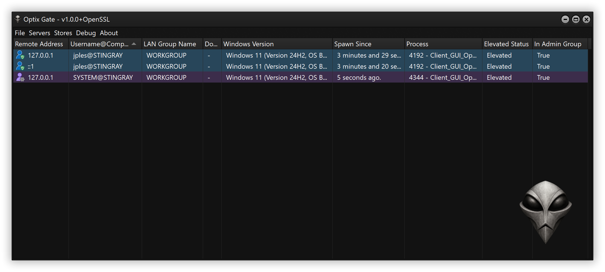

Optix is a secure, open-source (GPLv3) multi-purpose Remote Access Tool for Windows. It operates using reverse connections and supports OpenSSL for securing communications between the server and its clients through mutual authentication (mTLS).

Optix can be used for:

- Securely manage your Windows machine fleet (Note: for production use, make sure to run only the version with OpenSSL support if your goal is remote administration of your infrastructure).
- Speed up solving CTF challenges that focus on the Windows ecosystem.
- Certain pentesting engagements, for the same reasons as with CTFs.

However, when it comes to Red Team missions, note that this tool is of no use. The simple reason is that it is not designed for stealth. A Remote Access Tool of this nature is inherently noisy, does not operate through covert channels (by design), and would very likely lead to quick detection and failure in such contexts.

Furthermore, studying the source code will allow you to gain a deeper understanding of this type of program, which is highly comprehensive and covers multiple domains, including, but not limited to: network programming, system programming, cryptography, Windows API implementation and Windows internals, graphical interface creation and management, as well as parallelism and multithreading. This project complements the resources available on the Malware Gallery platform ([Malware Gallery](https://www.malwaregallery.com)), and the two will mutually enhance each other.

It is important to distinguish between a Remote Access Tool and a related category of malware known as a Remote Access Trojan (RAT). The key difference lies in intent: a Trojan is any program that disguises itself as legitimate, for example, in appearance or execution pretext, but actually performs malicious actions without the knowledge of the user.

⚠️ *Optix will not, and will never, implement code that facilitates such usage. This includes features intended solely for malicious purposes, evasion or stealth techniques, client configuration patching, and persistence mechanisms. If you are conducting a penetration test and require such features, it is your responsibility to implement them and compile your own version.*

The programming language used in this project is Delphi. In recent years, Embarcadero made a significant decision by offering a completely free edition of Delphi for open-source projects and students. You can now use the latest version of the IDE for free, provided you comply with their usage terms.

Finally, Optix is a reference to an old Remote Access Trojan of the same name from the early 2000s, and the program's logo is also a direct reference to it. The connection is a tribute, which is a recurring theme in many of my projects.

---


Optix Gate is proudly sponsored by Embarcadero, the company behind Delphi / C++ Builder and many other groundbreaking developer tools. I'm deeply grateful for their invaluable support, which makes this open-source project possible.

Although Optix Gate is developed using the latest professional version of Delphi (currently `13`), it has been designed to work seamlessly with the latest Community Edition (CE), which is completely free. You can download and install Delphi CE at no cost [here](https://www.embarcadero.com/products/delphi/starter/free-download).

---

## Key Features

* Multi-threaded and parallelized environment for managing multiple clients simultaneously
* Mutual authentication (**mTLS**) between peers using **TLS 1.3** with **AES-256-GCM SHA-384** via OpenSSL for secure communication
* Multi-listener (server) support with compatibility for both **IPv4** and modern **IPv6**
* Remote shell with multiplexing
* Remote file manager
* Remote process manager
* 100% free, 100% open-source, forever

…and much more to do, much more to come.

## The Protocol

This section details the key components of the protocol, which form the strength of the program and are designed for easy extensibility:

### Command And Control aka Session Handler

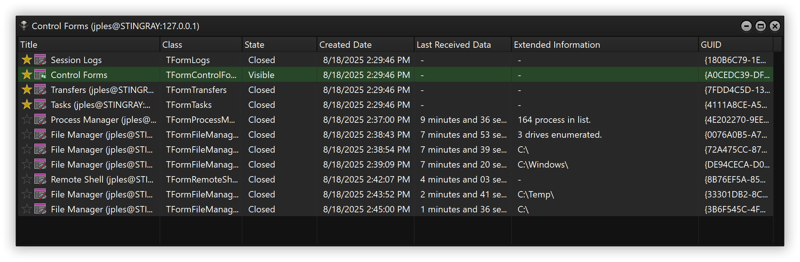

The session handler, on both the client and server sides, is responsible for transmitting and receiving Optix packets. An Optix packet object contains either a command with a variable number of arguments depending on the desired action, or a response from an executed command. Packets are serialized as JSON objects and sent over the network to be deserialized and processed by the remote peer.

Packets are managed in the session handler thread using a threaded queue, which allows packets to be registered from any thread in a thread-safe manner without the need for complex checks or mechanisms.

Sometimes, a command, once executed, needs to provide feedback to the server, for example, when requesting a process list, and must target a specific form (window), called a control form. Packets keep track of the handler ID, session ID, and window ID to ensure that, in cases where multiple clients are being controlled simultaneously, responses are received in the correct location. Some features, such as the file manager, even allow multiple control windows to be opened for a single client instance.

### Multiplexed File Transfer

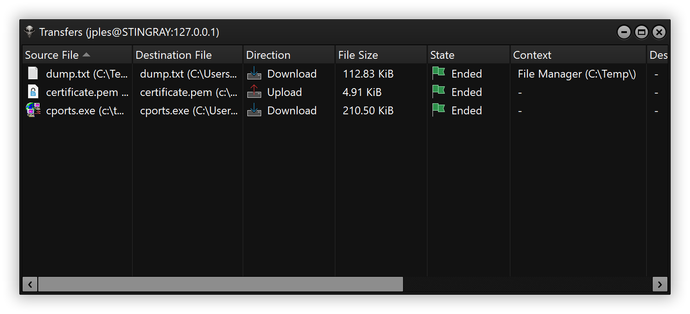

Interestingly, this time I did not use the classic method for transferring files over the network. In the past, I would open a new socket connection and create a new thread for each file to be transferred. While this approach was easy to manage, transferring a large number of files could quickly degrade system performance and even cause instability. To mitigate this, I had implemented a queue system to limit the number of concurrent file transfers.

For this version, I chose a completely different approach. All files are transmitted using a single dedicated socket and thread per Client Session, whether uploading or downloading. Transfers are orchestrated through this single connection, with files sent iteratively in chunks, one file at a time. This allows multiple files to be transferred “simultaneously” while preserving network speed, CPU usage, and memory efficiency.

The only limitation is that the overall transfer time increases with the number of files. However, this method allows thousands of files to be transmitted concurrently without compromising system performance or stability.

### Jobs / Tasks

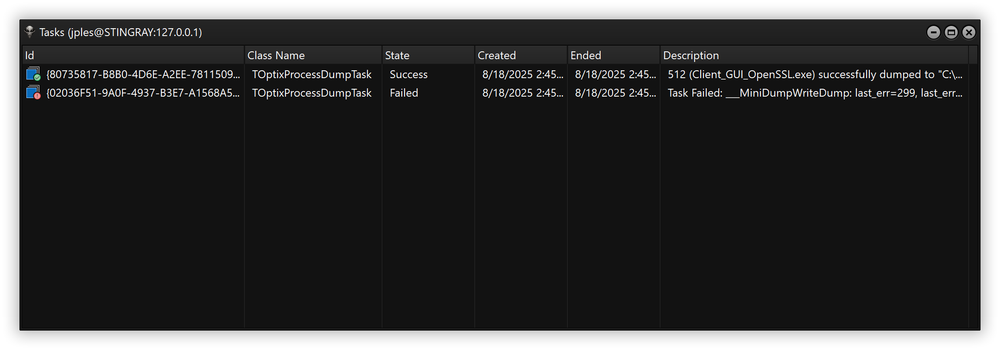

Sometimes an action can take a considerable amount of time to complete (e.g., file or registry searches, process dumps, etc.). Executing such actions directly from the Session Handler, as is done for standard commands (e.g., killing or list process), can seriously and negatively impact the responsiveness of other actions that require low latency (e.g., retrieving process lists, file lists, or service lists).

To address this issue, I implemented a task management system using Delphi's Parallel Programming Library (PPL). This system is responsible for registering and scheduling tasks while providing the Server with continuous feedback on task status (waiting, running, succeeded, or failed). This approach allows long-running operations to execute in the background, scheduled for optimal timing, without compromising the program's responsiveness.

Once a task completes successfully, the Server receives and records its result in its task manager. The user can then access the results at any time, for example, to download a dumped file or perform further actions.

### Multiplexed Remote Shell

One of the most important features for remote management is access to a shell. It is therefore natural that Optix included this feature from its very first version, fully integrated into its protocol and managed by the Session Handler. A single remote shell session is often insufficient, as multiple shell windows are frequently needed to perform concurrent actions.
Optix allows opening multiple remote shell sessions either through tabs within the same window or by opening multiple windows with separate shell instances for the same session. This is achieved using the Session Handler shell orchestration without sacrificing responsiveness or performance. Each shell's input and output are correctly dispatched to their respective processes, with support for interrupts (`CTRL+C`) to terminate long-running tasks. Notably, this design does not require a secondary socket or thread, which reduces resource consumption, simplifies management, and minimizes the risk of errors when handling multiple threads per client session.

The only minor drawback is a slight latency in shell output display, as each shell instance's output is polled at regular intervals to maintain thread responsiveness. This does not pose a significant issue, though further optimization could be considered if lower latency for shell output dispatching becomes necessary.

## Conclusion

To conclude on the protocol, these four points represent the program's core pillars and were essential to establishing Optix as a solid solution from its first release candidate. They ensure safe, thread-managed command/response processes, support for multi-file transfers, processing of long-running actions with constant feedback, and parallel shell session access.

The file management system also demonstrates a component of the protocol called Workers. Unlike my previous programs, Optix aims to minimize the number of required connections and threads per client session. However, relying solely on the Session Handler (main socket + thread) is sometimes insufficient. For instance, file transfers, though technically possible over the main connection, would excessively degrade the Session Handler's performance. In such cases, it is necessary to register a Worker. A Worker is a dedicated thread with its own socket connection, tied to an existing client session. It remains active as long as the main client session remains. This design also anticipates future features, such as Remote Desktop, which would require its own dedicated Worker thread.

In conclusion, Optix is architected to support future growth and feature expansion. Only minor improvements to the protocol, such as optimizations or code readability enhancements, may be needed over time.

## Understanding Optix Parts

### Server

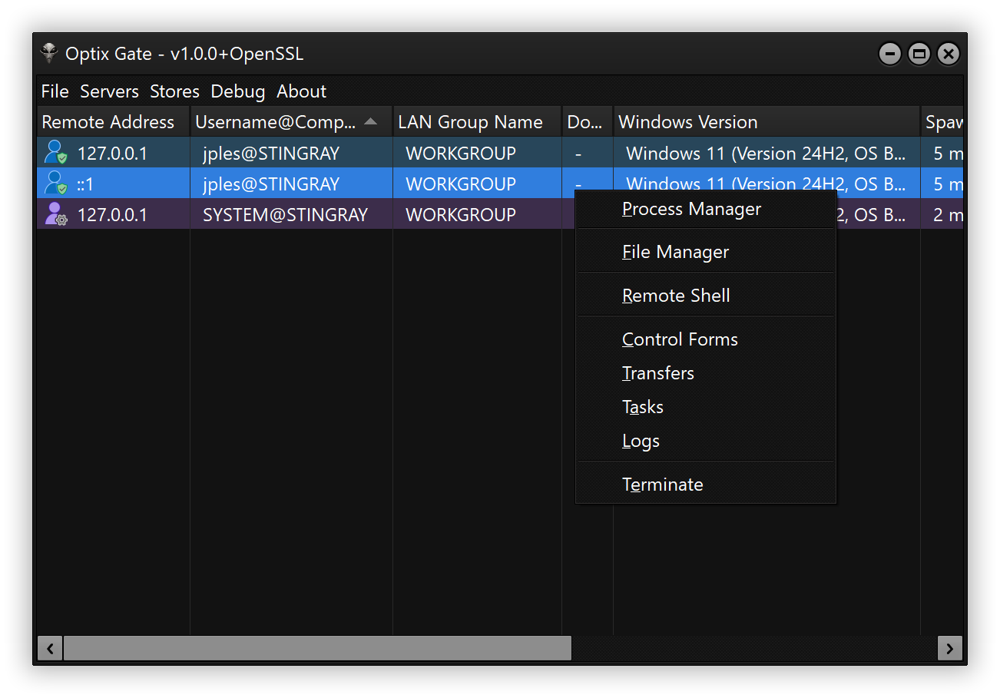

The server is the command-and-control component of the system. It is the program used to manage and take control of remote systems, referred to as clients.

#### Multi-listener

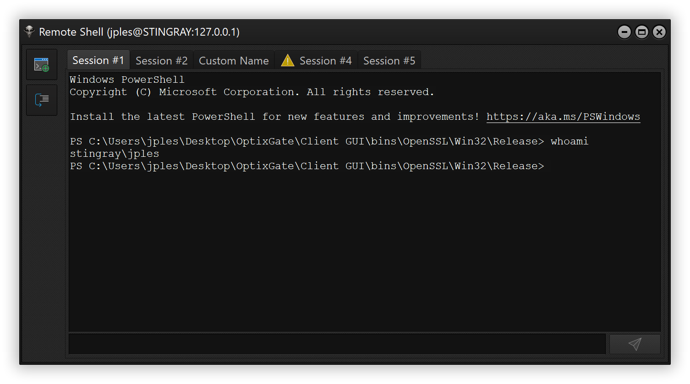

The multi-listener feature allows the server to listen on multiple ports simultaneously, ensuring flexibility when clients are configured to connect through different ports. It is particularly useful in environments where services must be accessible over both IPv4 and IPv6, even on the same port.

### Client GUI

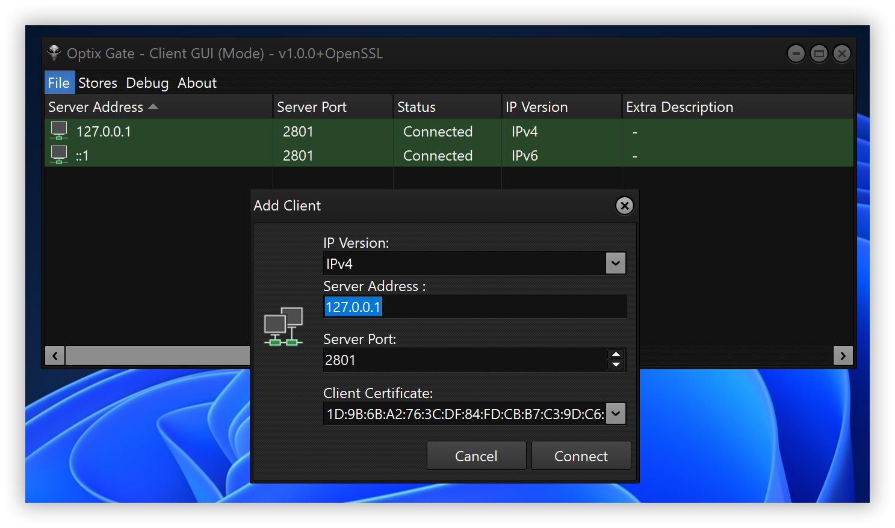

The client is the component that receives control from the server. The distributed version of Optix (the compiled version) includes only the Client GUI, a graphical interface designed for users who want to securely receive assistance or test the program without having to compile their own standalone client.

The Client GUI allows users to connect to one or multiple servers simultaneously through its intuitive graphical interface.

### Client

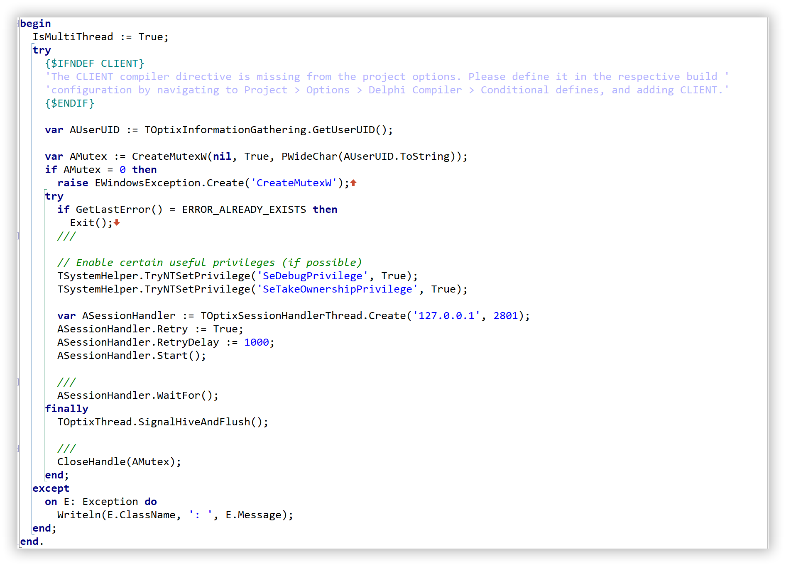

The client, available only as a minimal template, is by default a console application that connects to a remote server defined statically in the code. This component is neither distributed as binaries nor provided with an easy way to patch its configuration. It is entirely the user's responsibility to modify the relevant parts of the code to suit their specific needs.

As stated in the introduction, Optix will never facilitate program misuse and does not provide any code intended for such purposes. Any modifications made to the code are solely the responsibility of the user and fall outside the scope of my concern.

#### NoSSL / OpenSSL Versions

Optix is available in two variants: NoSSL, which excludes any OpenSSL-related features, and the recommended version, which integrates the OpenSSL library on top of sockets. I recall the difficulties I faced when working with SubSeven Legacy few years ago, particularly deciphering the OpenSSL documentation to integrate its APIs with custom networking components. In Optix, the OpenSSL wrapper has been improved to simplify integration and also serves as a practical example of how to implement OpenSSL in native socket programming.

The OpenSSL-enabled version of Optix encrypts network communication using TLS 1.3 with AES-256-GCM SHA-384, a robust and secure protocol and cipher suite. Client and server are mutually authenticated (mTLS) through certificate fingerprints checking on both sides. This approach makes it virtually (at least today speaking) impossible to intercept communications or perform man-in-the-middle (MITM) attacks without physical access to either the client or the server machine.

Both versions are offered for a specific reason. In Capture the Flag (CTF) contexts, it is not always necessary to add this layer of security, and in some cases, the NoSSL version may be easier to use. However, in most other scenarios, it is strongly recommended to use the OpenSSL version to ensure that communication between client and server is encrypted and that both sides are properly authenticated.

Finally, Optix was designed for flexibility: compiling with or without OpenSSL support is straightforward, thanks to conditional compiler expressions. This approach maintains a single code base, while ensuring that the NoSSL build contains no OpenSSL-related code whatsoever.

##### Basic Usage

As this concept may seem confusing at first, I will explain the concept of the OpenSSL version of Optix, focusing on proper configuration for smooth mutual authentication.


Ideally, both the Client and Server should have their own certificates, although it is not strictly mandatory for them to be different. For security reasons, using distinct certificates is strongly recommended. Once the respective certificates are generated, the server's certificate must be registered in the client's trusted certificate store, and similarly, the client's certificate fingerprint must be registered in the server's trusted client certificate store.

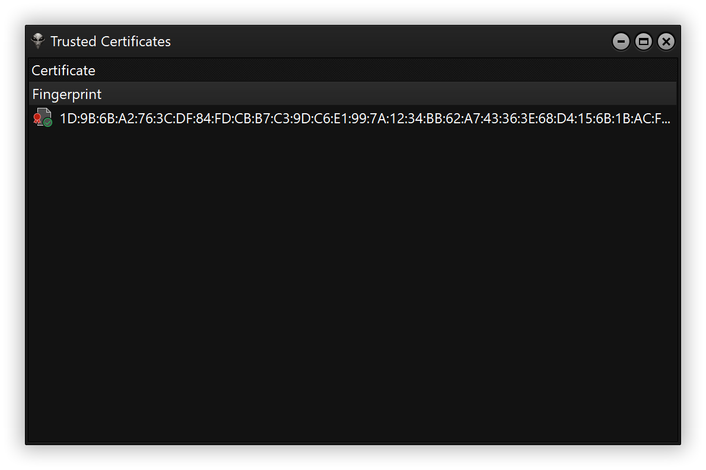

This setup ensures that the client's certificate is recognized as valid by the server, and vice versa.

It is possible to generate multiple certificates and register several trusted certificates in each store. When starting the server or adding a client, you must specify the certificate to use, ensuring it matches the certificate expected by the remote peer.

## Existing Features

### Process Manager

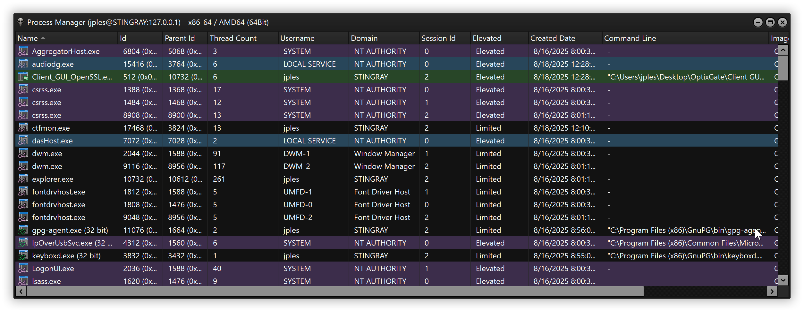

The Process Manager allows retrieving the list of currently running processes on a remote system. For each process, detailed information is provided, including (but not limited to):

- Process ID
- Name
- Parent ID
- Image Path
- Session ID
- Thread Count
- Start Time
- Command Line
- Architecture
- Elevation Status

Elevated processes are highlighted in a distinct color, as are the current client process and those running under NT AUTHORITY/SYSTEM. This visual differentiation makes it easy to quickly identify the processes of interest. Color highlighting can be disabled if preferred. Additionally, depending on the architecture of the client and the enumerated processes, certain actions may not be available.

#### Process Dump

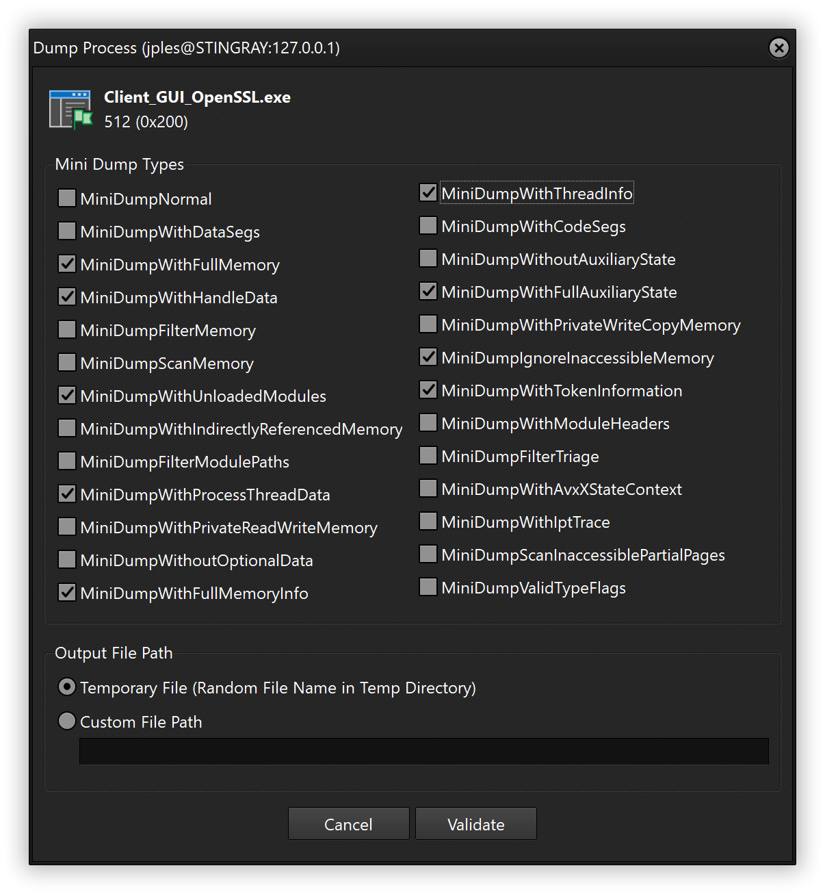

Optix currently provides an initial technique for dumping processes using the `MiniDumpWriteDump` Windows API. Additional methods will be implemented in future versions.

### File Manager

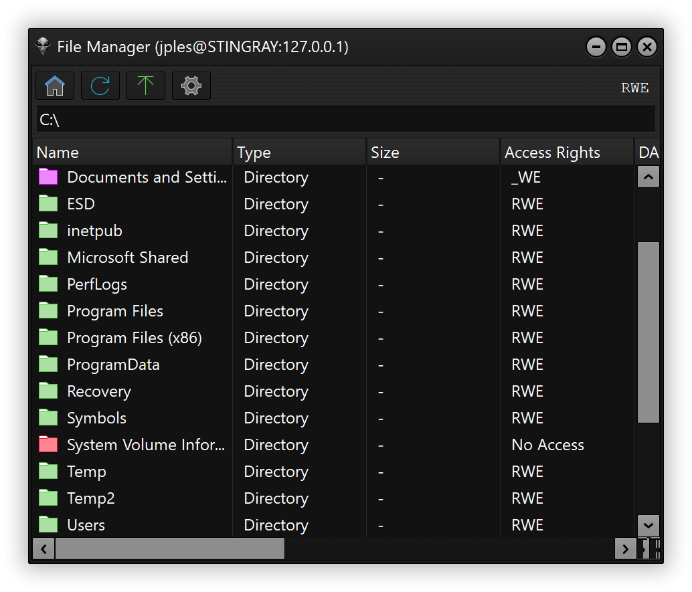

The File Manager allows browsing the remote file system. At present, the available actions are limited to:

- Uploading a file to the current folder (if permitted).
- Uploading a file to a selected folder (if permitted).
- Downloading a selected file (if permitted).

Additional file management actions will be introduced in future versions.

A noteworthy aspect of the File Manager, which will also be extended to future features such as the Remote Registry Editor or Services Manager, is its Access Control List (ACL) analysis. For each file, ACLs are evaluated to determine read, write, or execute permissions. This makes it possible to immediately understand what actions can be performed in the current path.

For folders, access rights are visually represented with color codes (which can be disabled) to quickly identify permissions:

- Red: No Access
- Yellow: Read and Execute
- Orange: Execute Only
- Blue: Read Only
- Green: Full Access

This approach reflects the ambition to provide users with clear, actionable insights at a glance, helping them both to solve challenges and to improve the overall security posture of certain elements.

### Remote Shell


As extensively discussed in the protocol section, this is a core feature for remote system management. It supports unlimited parallel sessions as well as interrupts to terminate long-running commands.

### What will you learn?

* Windows APIs and system internals
* Native socket programming
* Implementing OpenSSL on top of native socket programming
* Designing, writing, and maintaining custom network protocols
* Advanced concepts in the Delphi programming language

And additional related skills

### The future?

Many additional actions are planned for existing features, and several new capabilities are also in development. One of my priorities is to enable the execution of .NET assemblies and PE files directly from memory. In addition, I plan to implement a Func-In engine to make the application more extensible, allowing seamless integration of third-party tools instead of reinventing functionality that already exists and performs well.

Stability is my top priority; new features come second.

## Changelogs

### 1.1.0 (Sept 2025)

* **Folder Tree View Added to File Manager:** The browsed folder tree is now optionally available in the file manager (default: enabled).
* **File Upload Feedback Added:** When a file is uploaded, all file manager windows are notified if the new file matches the current directory (reactive update).
* **Significant Protocol Improvements:** While not directly visible in the compiled version, the underlying code has been greatly enhanced. Optix command dispatching is now handled generically, and command/response serialization and deserialization are partially automated using the power of Delphi RTTI for most basic object and property types. This considerably reduces the time required to implement new commands and responses, minimizes potential implementation errors, and makes the project much easier to expand.

### 1.0.0 (Sept 2025)

* **Column sorting:** Improved data navigation with sortable columns.
* **ZLib data compression:** Optimized performance through compression of Optix packets (JSON commands and responses).
* **File manager enhancements:** Added backward/forward navigation for easier file browsing, and go to location.
* **Execute-only folders:** Introduced a dedicated folder icon to clearly identify execute-only directories.
* **Multi-listener support:** Manage multiple servers with saved configurations and automatic startup.
* **IPv6 compatibility:** Full support for modern IPv6 networking alongside IPv4.
* **Code improvements:** General optimizations and refinements for better stability and maintainability.

### 1.0.0 Alpha 1 (August 2025)

* First release ever.

## Dependencies

OptixGate (Server) and the Client GUI both require the [Virtual Treeview component from JAM Software](https://www.jam-software.com/virtual-treeview); it is recommended to use the latest available version. OptixGate additionally requires OMultiPanel to be compiled, which is necessary for Remote Shell panel splitting. [XSuperObject](https://github.com/onryldz/x-superobject) library from vkrapotkin and [OMultiPanel](https://sourceforge.net/projects/omultipanel/) from Ondřej Pokorný are also used.  

*You will find the third-party Delphi libraries used in the project source code, matching the exact versions I worked with, in the folder `Libraries > Delphi`.*

It is recommended to use the latest version of Delphi. You can install the [Delphi Community Edition](https://www.embarcadero.com/products/delphi/starter/free-download), which is available free of charge and fully sufficient to compile the entire project.

For OpenSSL support, it is recommended to use the distributed DLLs provided in the Library folder. You may use your own compiled version at your own risk. The OpenSSL version should be at least equal to or higher than the version included in the project, though compatibility is not guaranteed.

Instructions for installing Delphi components and compiling project are not provided; however, resources are readily available online for those with basic familiarity with Delphi.

## Disclaimer

This software and code is provided for educational purposes and general informational use only. While it may be applicable in real-world scenarios and can be used in legally compliant contexts, the software and code is provided "as is" without any warranties, express or implied, including but not limited to warranties of merchantability, fitness for a particular purpose, or non-infringement.

The developer makes no representations or guarantees regarding the accuracy, reliability, suitability, or effectiveness of the software when used in any specific application or environment, including but not limited to professional, commercial, or legal contexts.

By using this software and code, you acknowledge and agree that:

- You are solely responsible for how the software is used and for ensuring its suitability for your specific needs.
- You assume all risks associated with its use, including any direct, indirect, incidental, or consequential damages that may result.
- The developer shall not be held liable for any loss, damage, or legal claims arising from your use or misuse of the software, whether in an educational, personal, or professional capacity.

Modifying or redistributing the code is done entirely at your own responsibility.

Use of this software and code constitutes acceptance of this disclaimer. If you do not agree to these terms, you should not use the software and code.

> The GPLv3 license allows anyone to use, modify, and distribute the software freely, as long as any derivative works are also shared under the same license. It requires that **source code be made available when distributing binaries**, provides no warranty or liability for the author, and includes protections against patent claims and hardware restrictions that prevent user modifications. Commercial use is permitted, provided all GPLv3 obligations are met.

## Contact

I will not respond to requests regarding custom demands, specific versions of the program, or provide support on installation, configuration, or usage. This program is intended for users with a minimum level of technical knowledge.

Feedback, however, is highly appreciated. You may contact me via email at jplesueur[at]phrozen.io, using the following PGP key:

```
-----BEGIN PGP PUBLIC KEY BLOCK-----
xjMEZQDTERYJKwYBBAHaRw8BAQdAUICkUuZmCktHcxi1tfHGQTTT/TrJCOqA
jymKVkrN6q/NK2pwbGVzdWV1ckBwaHJvemVuLmlvIDxqcGxlc3VldXJAcGhy
b3plbi5pbz7CjAQQFgoAPgWCZQDTEQQLCQcICZAqv1dYE4gcUwMVCAoEFgAC
AQIZAQKbAwIeARYhBHEqqY9tzg5HN9EB+yq/V1gTiBxTAACuFQD/UllBJFEY
CqE4+W/aR/vX+TLJmvNcmfTCcLE4DLNihDsA/2rms3XBBySjSmGTBizIvAYu
aB8fEEjtjUNGU6VOGL4IzjgEZQDTERIKKwYBBAGXVQEFAQEHQIn/iNRs3IO1
Eh/8FG6+1FV/nEywsK28hDgXwOzDQIJxAwEIB8J4BBgWCAAqBYJlANMRCZAq
v1dYE4gcUwKbDBYhBHEqqY9tzg5HN9EB+yq/V1gTiBxTAAD7sAD/fkYNudvg
fEiBdAPaKVXCzTQP2tT8uBAGVLPjzAmXzHEBAKlQ5auOh+8tyfeK73RfCbW7
zRt12rJmulmCvpFscq8G
=3Qtg
-----END PGP PUBLIC KEY BLOCK-----
```

## Special Thanks

I would like to thank the following people for their support, extensive testing, and early feedback

- [Mr.NOODLE](https://x.com/bragames2)
- [Euz](https://x.com/_Euzebius)
- [Mudpak](https://x.com/_mudpak)
- [Tristan Manzano](https://www.linkedin.com/in/tristan%2Dmanzano%2D963223103/)
- [Laurent Minne](https://www.linkedin.com/in/laurent%2Dminne/)
